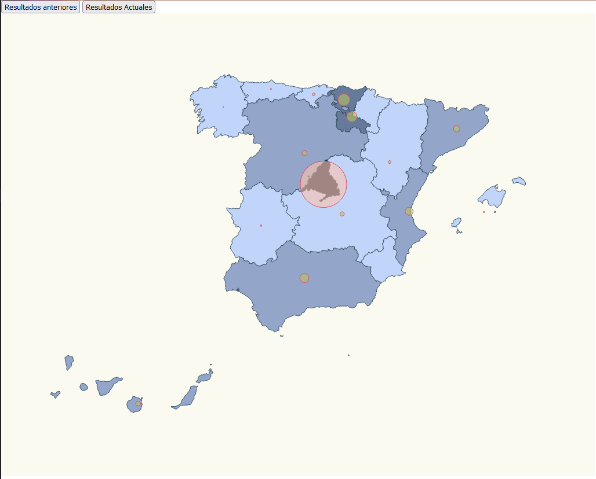
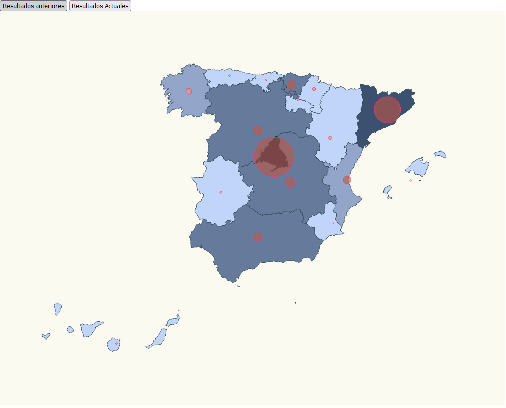

# data-visualization-covid19-spain-map-v2





# Objective

Our objective is compare the situation of COVID cases in the different communities of Spain. In addition, we will also show the communities in different colors. The darker the color, the greater is the number of cases.

We have two challenges:

- Set a color scale for the number of cases.
- Set a color for each community depending of it's number of cases using the color scale.

EXTRA: Change colors of circles depending of affected cases

# Prerequisits

Let start using the example of https://github.com/ajbalmisa1/data-visualization-covid19-spain-map.

Then we need to run _npm install_ in the terminal among other commands to install everything necessary to have our map running.

```bash
npm install
```

To have projections on our map and bring the Canary Islands closer to the peninsula, we must install the _d3-composite-projections_ module and be able to include it in a topojson map using the second command.

```bash
npm install d3-composite-projections --save
```

```bash
npm install @types/topojson-client --save-dev
```

In order to read the _require_ in _index.ts_ we need to launch the following command:

```bash
npm i --save-dev @types/node
```

# Steps

The first thing we have had to do is search for the data, for this we have gone to the government data repository (datos.gob.es), to search for those affected by the pandemic at the autonomous community level . The data has been saved in a stats.ts file along with the data that we had of affected by COVID-19 in March 2020 inside the src folder, leaving the following result.

./stats.ts

```typescript
export const stats_previous = [
  { name: "Andalucía", value: 34 },
  { name: "Aragón", value: 11 },
  { name: "Asturias", value: 5 },
  { name: "Islas Baleares", value: 6 },
  { name: "Islas Canarias", value: 18 },
  { name: "Cantabria", value: 10 },
  { name: "Castilla La Mancha", value: 16 },
  { name: "Castilla y León", value: 19 },
  { name: "Cataluña", value: 24 },
  { name: "Valencia", value: 30 },
  { name: "Extremadura", value: 6 },
  { name: "Galicia", value: 3 },
  { name: "Madrid", value: 174 },
  { name: "Ceuta y Melilla", value: 0 },
  { name: "Murcia", value: 0 },
  { name: "País Vasco", value: 45 },
  { name: "La Rioja", value: 39 },
];

export const stats_current = [
  { name: "Andalucía", value: 6392 },
  { name: "Aragón", value: 2491 },
  { name: "Asturias", value: 1322 },
  { name: "Islas Baleares", value: 1131 },
  { name: "Islas Canarias", value: 1380 },
  { name: "Cantabria", value: 1213 },
  { name: "Castilla La Mancha", value: 7047 },
  { name: "Castilla y León", value: 6847 },
  { name: "Cataluña", value: 19991 },
  { name: "Valencia", value: 5922 },
  { name: "Extremadura", value: 1679 },
  { name: "Galicia", value: 4432 },
  { name: "Madrid", value: 29840 },
  { name: "Ceuta y Melilla", value: 113 },
  { name: "Murcia", value: 1041 },
  { name: "Navarra", value: 2497 },
  { name: "País Vasco", value: 6838 },
  { name: "La Rioja", value: 1960 },
];
```

We have also created the ResultEntry interface to dynamically assign the data according to the button we click.

```typescript
export interface ResultEntry {
  name: string;
  value: number;
}
```

## src/index.html

To add the buttons we must include the following code in html, within the group 'body'

```html
<html>
  <head>
    <link rel="stylesheet" type="text/css" href="./map.css" />
    <link rel="stylesheet" type="text/css" href="./base.css" />
    <link rel="stylesheet" type="text/css" href="./style.css" />
  </head>
  <body>
    <button id="Previous">Resultados anteriores</button>
    <button id="Actual">Resultados Actuales</button>
    <script src="./index.ts"></script>
  </body>
</html>
```

## src/communities.ts

In this file, we need include the next code:

```typescript
export const latLongCommunities = [
  {
    name: "Madrid",
    long: -3.70256,
    lat: 40.4165,
  },
  {
    name: "Andalucía",
    long: -4.5,
    lat: 37.6,
  },
  {
    name: "Valencia",
    long: -0.37739,
    lat: 39.45975,
  },
  {
    name: "Murcia",
    long: -1.13004,
    lat: 37.98704,
  },
  {
    name: "Extremadura",
    long: -6.16667,
    lat: 39.16667,
  },
  {
    name: "Cataluña",
    long: 1.86768,
    lat: 41.82046,
  },
  {
    name: "País Vasco",
    long: -2.75,
    lat: 43.0,
  },
  {
    name: "Cantabria",
    long: -4.03333,
    lat: 43.2,
  },
  {
    name: "Asturias",
    long: -5.86112,
    lat: 43.36662,
  },
  {
    name: "Galicia",
    long: -7.86621,
    lat: 42.75508,
  },
  {
    name: "Aragón",
    long: -1.0,
    lat: 41.0,
  },
  {
    name: "Castilla y León",
    long: -4.45,
    lat: 41.383333,
  },
  {
    name: "Castilla La Mancha",
    long: -3.000033,
    lat: 39.500011,
  },
  {
    name: "Islas Canarias",
    long: -15.5,
    lat: 28.0,
  },
  {
    name: "Islas Baleares",
    long: 2.52136,
    lat: 39.18969,
  },
  {
    name: "Navarra",
    long: -1.65,
    lat: 42.816666,
  },
  {
    name: "La Rioja",
    long: -2.445556,
    lat: 42.465,
  },
];
```

## src/map.css

```css
.country {
  stroke-width: 1;
  stroke: #2f4858;
  fill: #c1d5fa;
}

.selected-country {
  stroke-width: 1;
  stroke: #e34367;
  fill: #ecb9c5;
}

.affected-marker {
  stroke-width: 1;
  stroke: #e34367;
  fill-opacity: 0.6;
}
```

## src/index.ts

First, we need include the imports routes:

```typescript
import * as d3 from "d3";
import { interpolateMagma } from "d3";
import { on } from "node:events";
import * as topojson from "topojson-client";
const spainjson = require("./spain.json");
const d3Composite = require("d3-composite-projections");
import { latLongCommunities } from "./communities";
import { stats_current, stats_previous, ResultEntry } from "./stats";
```

Now wi will create div where inserted the tooltip that in the future show name of community and affected cases.

```typescript
const div = d3
  .select("body")
  .append("div")
  .attr("class", "tooltip")
  .style("opacity", 0);
```

Then, we must create a function to return those affected, given the name of a community and the dataset of the values.

```typescript
const getAffectedCases = (comunidad: string, data: any[]) => {
  const entry = data.find((item) => item.name === comunidad);
  return entry ? entry.value : 0;
};
```

Other function that use the previous one, get the maximum value in dataset, for after return the value scaled.

```typescript
const calculateBasedOnAffectedCases = (comunidad: string, data: any[]) => {
  const value = getAffectedCases(comunidad, data);
  var max = data.reduce(
    (max, item) => (item.value > max ? item.value : max),
    0
  );
  return (value / max) * 40;
};
```

Next, we will change the function to calculate the radius based on the number of affected scaled:

```typescript
const calculateRadiusBasedOnAffectedCases = (
  comunidad: string,
  data: any[]
) => {
  return calculateBasedOnAffectedCases(comunidad, data);
};
```

Build and creation of Spain map

```typescript
const aProjection = d3Composite
  .geoConicConformalSpain() // Let's make the map bigger to fit in our resolution
  .scale(3300) // Let's center the map
  .translate([500, 400]);

const geoPath = d3.geoPath().projection(aProjection);
const geojson = topojson.feature(spainjson, spainjson.objects.ESP_adm1);
);

const svg = d3
  .select("body")
  .append("svg")
  .attr("width", 1024)
  .attr("height", 800)
  .attr("style", "background-color: #FBFAF0");

svg
  .selectAll("path")
  .data(geojson["features"])
  .enter()
  .append("path")
  .attr("class", "country")
  .attr("d", geoPath as any);
```

In the next point, we must create the UpdateData function, in order to delete the existing circles and create new circles with dynamic radius and color depending of the maximum number of cases in one community, also we will applied similar functions for communities.

The changes are:

- **calculateMaxAffected**: Each time a button is interacted with and a different dataset is used, the maximum number of affected in the dataset will be calculated.

- **colorCommunity** and **colorCircle**: Two scale threshold for assign the colors depending to value of affected cases.

- **assignColor**: receives as inputs the name of the community, the dataset and a Boolean to classify if it is necessary to color circles or communities.

Then, the communities and circles are recreated using the previous functions, the radius, the colors being variable and tooltips are created. 

```typescript
const updateData = (data: any[]) => {
  svg.selectAll("path").remove();
  svg.selectAll("circle").remove();

  const calculateMaxAffected = (data) => {
    return data.reduce((max, item) => (item.value > max ? item.value : max), 0);
  };
  const maxAffected = calculateMaxAffected(data);

  const colorCommunity = d3
    .scaleThreshold<number, string>()
    .domain([
      0,
      maxAffected * 0.1,
      maxAffected * 0.2,
      maxAffected * 0.6,
      maxAffected * 0.7,
      maxAffected,
    ])
    .range([
      "#e6f4f1",
      "#c1d5fa",
      "#93a6ca",
      "#667a9c",
      "#3c5170",
      "#3f4756",
      "#122b47",
    ]);

  const colorCircle = d3
    .scaleThreshold<number, string>()
    .domain([0, 50, 100, 1200, 5000, 50000])
    .range(["#6ca550", "#b5c362", "#fde181", "#ffc3ac", "#fc8c77", "#bf5847"]);

  const assignColor = (
    comunidad: string,
    dataset: ResultEntry[],
    circle: boolean
  ) => {
    const entry = dataset.find((item) => item.name === comunidad);
    if (circle) {
      return entry ? colorCircle(entry.value) : colorCircle(0);
    }
    return entry ? colorCommunity(entry.value) : colorCommunity(0);
  };

  svg
    .selectAll("path")
    .data(geojson["features"])
    .enter()
    .append("path")
    .attr("class", "country")
    .attr("d", geoPath as any)
    .style("fill", function (d: any) {
      return assignColor(d.properties.NAME_1, data, false);
    });

  svg
    .selectAll("circle")
    .data(latLongCommunities)
    .enter()
    .append("circle")
    //.transition()
    //.duration(500)
    .attr("class", "affected-marker")
    .attr("fill", (d, i) => {
      return assignColor(d.name, data, true);
    })
    .attr("r", (d) => calculateRadiusBasedOnAffectedCases(d.name, data))
    .attr("cx", (d) => aProjection([d.long, d.lat])[0])
    .attr("cy", (d) => aProjection([d.long, d.lat])[1])
    .on("mouseover", function (e: any, datum: any) {
      const coords = { x: e.x, y: e.y };
      div.transition().duration(200).style("opacity", 0.9);
      div
        .html(
          `<span>${datum.name}: ${getAffectedCases(datum.name, data)}</span>`
        )
        .style("left", `${coords.x}px`)
        .style("top", `${coords.y - 28}px`);
    })
    .on("mouseout", function (datum) {
      div.transition().duration(500).style("opacity", 0);
    });
};
```

Finally, we add the button logic with the click event

```typescript
document
  .getElementById("Previous")
  .addEventListener("click", function handleResultsApril() {
    updateData(stats_previous);
  });

document
  .getElementById("Actual")
  .addEventListener("click", function handleResultsNovember() {
    updateData(stats_current);
  });
```
